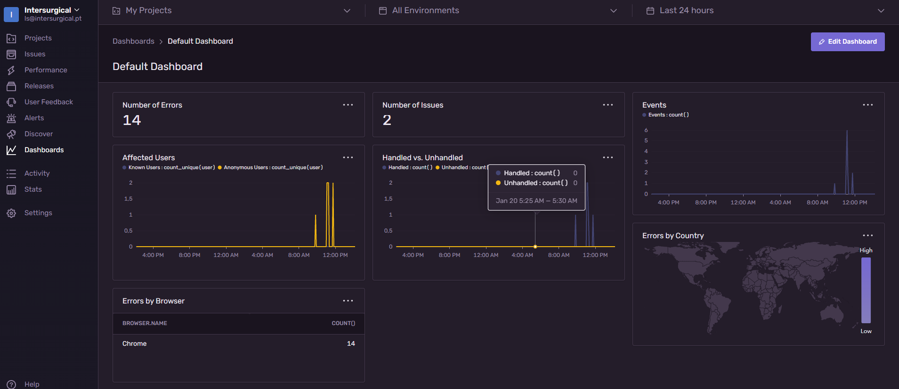

# Sentry Implementation Proposal<!-- omit in toc --> 

## Purpose<!-- omit in toc --> 
Document how Sentry can be installed in a self-hosted environment, managerd, used and integrated into new and developed applications

## Table of Contents<!-- omit in toc --> 
- [Installation in Self Hosted Environment](#installation-in-self-hosted-environment)
  - [Starting remarks](#starting-remarks)
  - [Installing docker](#installing-docker)
  - [Installing docker-compose](#installing-docker-compose)
  - [Installing Sentry](#installing-sentry)
- [Configuring Sentry](#configuring-sentry)
  - [Accessing Sentry](#accessing-sentry)
  - [Creating an account](#creating-an-account)
  - [Permission levels](#permission-levels)
- [Integration](#integration)
  - [Creating Project](#creating-project)
  - [Alerts](#alerts)
  - [Integration in project](#integration-in-project)
  - [Gitignore](#gitignore)
  - [Nuget](#nuget)
  - [Conventions and warnings](#conventions-and-warnings)
  - [AppSettings.json](#appsettingsjson)
  - [Initialization](#initialization)
  - [How to use](#how-to-use)
  - [Logging Exceptions, Infomation, Errors and Context](#logging-exceptions-infomation-errors-and-context)
    - [Log Breadcrumb](#log-breadcrumb)
      - [How to use](#how-to-use-1)
    - [Log Information](#log-information)
      - [How to use](#how-to-use-2)
    - [Log Error](#log-error)
      - [How to use](#how-to-use-3)
  - [Implementation examples](#implementation-examples)
    - [.NET Core](#net-core)
    - [.NET Framework](#net-framework)
- [Data Collection](#data-collection)
  - [Data collected by default](#data-collected-by-default)
  - [Data added manually](#data-added-manually)
- [Platform Usage](#platform-usage)
  - [Performance Tracking](#performance-tracking)
  - [Data analysis (Discover and Dashboard sections)](#data-analysis-discover-and-dashboard-sections)
  - [Sentry in offline environment](#sentry-in-offline-environment)
  - [Backups, Restore and Exports](#backups-restore-and-exports)
    - [Reports](#reports)
    - [Quick backup](#quick-backup)
    - [Quick restore](#quick-restore)
    - [Full Backup](#full-backup)

# Installation in Self Hosted Environment

## Starting remarks
* Every docker command was done through `putty` with the user `appuser`
* Every docker command was prefixed with the `sudo` command. From this point onward it'll be **implicit**

## Installing docker
- Check if docker is installed by running `docker version`
- If not installed please refer to the guide on docker's wiki on [how to install](https://docs.docker.com/engine/install/ubuntu/)
- Sentry requires:
  - Docker v19.03.6 or above
  - Docker compose v1.28.0 or above

## Installing docker-compose
- Check if docker-compose is installed by running `docker-compose version`
- If not installed please refer to the guide on docker's wiki on [how to install](https://docs.docker.com/compose/install/)

**Notes**
- If the server where you are trying to install ``docker-compose`` fails to execute the `curl` command you can download the docker-compose file directly from github ([Compose Releases](https://github.com/docker/compose/releases))
- Download the file labeled for `Linux-x86_64`
- Upload the file to the server and put it in `/usr/local/bin`
  
## Installing Sentry
**NOTE:** This setup will only work on a Linux environment

1. Download content from [Get Sentry - Self Hosted](https://github.com/getsentry/self-hosted)
2. Create a folder named `sentry` in `/srv`
3. Give `777` permissions recurssively every file/folder inside the created folder with:
   - `chmod -R 777 folderLocation`
4. Move the contents to ``/srv/sentry/`` and extract
5. Edit ``sentry/config.yml`` and set ``mail.host``, ``mail.port`` and ``mail.from`` like the image below
6. Run ```./install.sh```
7. When prompted add the owner user account
  - If not created now you will have to connect to the `sentry-self-hosted_web` container and run `sentry createuser` or you will not be able to enter Sentry
8. Run the command: `docker-compose up -d`
  
  

---

# Configuring Sentry

## Accessing Sentry
* Sentry is configured in port ``9000``.
* Upon accessing the portal the first time, Sentry will ask for credentials. 
* These credentials will be used to access the portal from now on and will the set as the system owner.

**Warning: To be able to remove this first user you'll need to add a second user with "Owner" permissions**

---

## Creating an account
- LDAP is not supported so integration with Active Directory is not possible. Every user needs to be created manually using an email verification.
- To create an account:
  - Access the Sentry server
  - Click on `Request to Join`
  - One of the system administrators will approve your registry
  - Sentry will send you a form to add your password
- When logged in:
  - Click on your user on the top left corner
  - Click on `User Settings`
  - Set your `Name` and `Time Zone`
  - If needed add additional settings

## Permission levels
- Sentry has several roles that can be used to control user access.


---

# Integration

## Creating Project

In order to create a project follow these steps:
* Go to `Settings` > ``Projects`` and click on `Create Project`
* Select the project platform (`.Net` or `.Net Core`)
* Define the default alert setting 
  * **Note:** By convention the default option should be `Alert me on every new issue`
* Give the project a ``name`` and assign the ``team`` responsible

**Note:** Do not forget to follow the naming convention `csxxxx_name`

---

## Alerts
  
* Go to ``Alerts`` and click on ``Create Alert``
* Select the project to monitor
* Select the ``type of alert`` and then click on ``Set conditions``
* Set the necessary alert settings for the ``Environment``, ``Team``, etc
* Set the necessary conditions to trigger the alert and to whom the notification will be sent to
* Go to `Settings` > `Projects` > `Your project` > `General Settings` > In `Subject Prefix`, add the name of your project  


  
**Note:** 
- `Action Interval` defines the cooldown between between e-mail alerts. 
  - **Example**: If `Alert A` is fired at ``12:00`` and has an `Action Interval` set to `30 minutes`, even if there are new alert triggers at `12:05`, the e-mails will only be sent at ``12:30``  


## Integration in project
- Nuget `Sentry`
- DSN Key (Requires completing the [Creating Project](#creating-project) step)
  - In Sentry go to `Settings` > `Projects` > `[Project_Name]`> `Client Keys` > `DSN` to see the key for the project you wish to track
  


## Gitignore
This will instruct git to ignore the caching folder created by Sentry
- To the ``gitignore`` file add the following lines:
  ```
    Sentry
    Sentry/
  ```


## Nuget
- Minimum version: .NET Standard 2.0 > [.Net Standard Compatibility Table](https://docs.microsoft.com/en-us/dotnet/standard/net-standard?tabs=net-standard-2-0#tabpanel_1_net-standard-2-0)
- Go to `Tools` > `Nuget Package Manager` > `Package Manager Settings` and set `Default package management format` as **PackageReference**
- Install the nuget `Intersurgical.Shared.Connectors.Sentry` via nuget package manager or via nuget command line

## Conventions and warnings
- **Settings** -> Should be stored in `AppSettings.json` or `Web.config` 
- **Naming Scheme** -> For the short name, projects should use common naming (ie. csxxxx_name)
- **Deployment Environments** -> Publish profiles should be configured to replace the **Deployment Environment** from `Development` to `Beta` or `Production`
- **Versioning** -> Applications without **version control** should have the version set as `1.0.0` and the ones with VC should have the version set with the same version in VC.
- **Messages** -> All strings created to be used in the logs should all be kept in a single file.
- **When publishing** -> Do not forget to give the `Sentry` folder read and write permissions or Sentry won't be able to create a its cache.

## AppSettings.json
-  Add the following configurations to your `appsettings.json` file:
```
"Log": {
	  "DsnKey": "key_from_Sentry",
    "ShortName": "csxxxx_name",
    "DeploymentEnvironment": "environment", //Where **environment** is the environment for each appsettings file (Development, Beta or Production)
    "Version": "1.0.0"
  }
```

**Notes:** 
- Publish profiles should be configured to replace the **Deployment Environment** from `Development` to `Beta` or `Production`
- Applications **with version control** should have the version set with the same version set in version control
- Applications **without version control** should have the version set as `1.0.0`

## Initialization
- Instantiate the connector by calling `SentryConnector(SentryParameters parameters)` and pass a `SentryParameters` object the following properties:
  - string `dsnKey` - The unique key for the project
  - string `version` - The application version
  - enum `DeploymentEnvironment` 
    - The application environment (Development, Beta or Production)
    - Can be changed depending on deployment environment via condition validation or automatically by defining in the publish profiles / web.config (check image below)
  - string `shortName` - The application short name (ie: IQR159)
  - IPrincipal user - The user for logging
- To the `<head></head>` of your `_Layout` file add: `<meta name="sentry-trace" content="{{ span.toSentryTrace() }}" />`

- **FOR/IN .NET CORE BASED APPLICATIONS**
  - In `Program.cs` in the `CreateHostBuilder` add `webBuilder.UseSentry();`
  - In `Startup.cs` in the `Configure` add `app.UseSentryTracing();`
    - This will activate Sentry's own middleware. If you have your own middleware then you do not need this configuration
  - In `Startup.cs` in the `ConfigureServices` if not present add `services.AddHttpClient();`
  
**Notes**
- If running with .NET 5 or below, make sure to put `app.UseSentryTracing();` right after `UseRouting()`.
- **Do not** instantiate the connector as a singleton. This will prevent the update of the captured context data during request.


## How to use
- `SentryConnector` provides a ``ILogService`` interface with the methods:
    - `LogInfo(string message)` - Sends an informational log to Sentry
    - `LogError(string message)` - Sends a non-exception error log to Sentry
    - `LogError(exception, string message)` - Sends a exception error log to Sentry
    - ``ILogService`` can be extended by using `ISentryConnector` which adds:
      - `LogBreadcrumb(string message, string eventCategory)` - Adds an event to the next sent log to form a trail of events that happened prior to an issue.

## Logging Exceptions, Infomation, Errors and Context
Passing data to Sentry is made by using:

### Log Breadcrumb
- These are optional and are annexed to methods and functions.
- Their main objective is to log system usage and create a trail that can be used to pinpoint what lead to the event
- These logs are **queued and sent with the next** `LogInformation` or `LogError`

#### How to use
```
LogBreadcrumb(string message, string eventCategory);
LogBreadcrumb("User did something specific!", "Authentication");
```

- ``Message`` - Can be any message but should be used to pass relevant information about the context connected to it (ex. User reached text field limit)
- ``Category`` - Can be any message but should be used to pass relevant information about the context connected to it (ex: Authentication)

### Log Information
- Their main objective is to log informational messages related to an event.
- Opposite to the breadcrumb logs these logs are sent to Sentry as soon as they are triggered 

#### How to use
```
LogInfo(string message)
LogInfo("User has created a new product")
```

- ``Message`` - Can be any message but should be used to pass relevant information about the context connected to it (ex. User created a new product)

### Log Error
- Their main objective is to log error messages related to an event.
- Opposite to the breadcrumb logs these logs are sent to Sentry as soon as they are triggered
- Use ``LogError(message)`` when dealing with an error that generally **does not** crash the application (ie. Unauthorized access, etc)
- Use ``LogError(message, exception)`` when dealing with an error that generally **does** crash the application (ie. Unauthorized access, etc)

#### How to use
```
LogError(string message)
LogException(exception, message)
LogError("User has tried to create a faulty entry")
LogError("User has crashed the app", exception)
```

- ``Message`` - Can be any message but should be used to pass relevant information about the context connected to it (ex. User reached text field limit)
- ``Exception`` - An exception object that contains the information related to the error

---
## Implementation examples
### .NET Core

```
Startup.cs
public void Configure(IApplicationBuilder app IWebHostEnvironment env, IServiceProvider serviceProvider)
{
  app.UseMiddleware<LoggerMiddleware>();
}
```

```
public class LoggerMiddleware
{
  private readonly RequestDelegate _requestDelegate;
  
  public LoggerMiddleware(RequestDelegate requestDelegate)
  {
      _requestDelegate = requestDelegate ?? throw new ArgumentNullException(nameof(requestDelegate));
  }

  public async Task Invoke(HttpContext httpContext, ILogService logService)
  {
      try
      {
          await _requestDelegate(httpContext);
      }
      catch (Exception ex)
      {
          logService.LogException(ex);

          throw;
      }
  }
}
```
```
public sealed class LogService : ILogService
{
  public LogService(IConfigurationService configurationService, IPrincipal currentUser)
  {
      this.sentryConnector = new SentryConnector(new SentryParameters(configurationService.DsnKey, configurationService.Version,
          GetLogEnviroment(configurationService.Enviroment),
          configurationService.ShortName, currentUser));
  }

  public void LogException(Exception exception)
  {
      this.sentryConnector.LogError(exception, exception.InnerException?.Message ?? exception.Message);
  }

  private Enums.DeploymentEnvironment GetLogEnviroment(string environment)
  {
      switch (environment.ToLower())
      {
          case "development": return Enums.DeploymentEnvironment.Development;
          case "beta": return Enums.DeploymentEnvironment.Beta;
          case "production": return Enums.DeploymentEnvironment.Production;
          default:
              throw new ArgumentOutOfRangeException("The Environment is not supported.");
      }
  }
}
```

### .NET Framework
```
Globalasax.cs
protected void Application_Error(object sender, EventArgs e)
{
    Exception ex = Server.GetLastError();
    LogService log = new LogService();
    log.LogException(ex);
}
```
```
NinjectWebCommon.cs
private static void RegisterServices(IKernel kernel)
{
    kernel.Bind<ILogService>().To<LogService>();
}
```
```
public class LogService : ILogService
{
  public LogService(IPrincipal principal = null)
  {
      ConfigurationService configurationService = new ConfigurationService();
      IPrincipal user = GetUser(principal, configurationService); ;

      this._dsnKey = configurationService.DsnKey;
      this._version = configurationService.Version;
      this._shortName = configurationService.ShortName;
      this._deploymentEnvironment = (DeploymentEnvironment)Enum.Parse(typeof(DeploymentEnvironment), configurationService.DeploymentEnvironment, true);
      this._user = user;
      this._parameters = new SentryParameters(_dsnKey, _version, _deploymentEnvironment, _shortName, _user);
      this._connector = new SentryConnector(_parameters);
  }  

  private static IPrincipal GetUser(IPrincipal principal, ConfigurationService configurationService)
  {
      IPrincipal user;
      if (principal != null)
      {
          user = principal;
      }
      else if (HttpContext.Current.User != null && !HttpContext.Current.User.ToString().Contains("DefaultAppPool"))
      {
          user = HttpContext.Current.User;
      }
      else
      {
          user = new CustomPrincipal(configurationService.LogUser);
      }

      return user;
  }

  public void LogException(Exception exception)
        {
            _connector.LogError(exception, exception.Message);
        }
}
```

# Data Collection

## Data collected by default
- Timestamp
- Error type
- Message
- HTTP Method
- Machine Name
- User agent
- Stack trace
- Operating System
- Browser

## Data added manually
- **Added by the user on instantiation or during log creation**
  - User name
  - Short Project Name
  - Application version
  - Deployment Environment

---

# Platform Usage

## Performance Tracking
Sentry tracks application performance, transactions, measures metrics like throughput and latency, and displays the impact of errors across services.

Using this information, it's possible to trace issues (ie. frontend to backend) and to identify poorly performing code. This allows us to answer questions like whether our application performance is getting better or worse, or if the latest release is running slower than previous ones, or even which specific services are slow. This data can then be used by the development team correct the code that’s degrading performance.


## Data analysis (Discover and Dashboard sections)
Sentry provides insights into all the captured data. This data can then be analysed and displayed as graphs and charts. The ``Discover`` section offers views of all saved/pre-built queries and allows us to quickly dive into areas that need immediate attention. For example, if a spike occurred in the past 24 hours for a query on errors. Each query is saved as a card that displays a summarized view of the data.

Along side the `Discover` section the `Dashboard` section provides us with a broad overview of the health of our applications by allowing us to navigate through error and performance data across multiple projects. Dashboards are made up of one or more widgets, and each widget visualizes one or more Discover queries.



---

## Sentry in offline environment
- In order to use the offline mode with Sentry, it's only necessary to install the ``Sentry`` nuget as it already brings the necessary configurations to allow Sentry to create a cache.
- If the connection to the Sentry server fails, the application server will keep a cached version of the generated logs in a folder labeled `Sentry` in the project folder. These will be sent to Sentry when the connection to the server is re-established.

**WARNING** 
- When publishing, do not forget to give the `Sentry` folder **read and write** permissions or Sentry won't be able to create a its cache.
 
## Backups, Restore and Exports

### Reports
- By default Sentry sends out a weekly report to all users with a summary of number of errors registered during the previous week, number of issues by type and a comparison between the last 3 months in order to provide a view on the general ongoing health of the applications as a whole. 
- Apart from the weekly automated, Sentry does not support exporting reports. It's possible to print the current view but the user would have to manually format the page to get a usable layout.
  
### Quick backup
 - If you need a quick way to backup and restore your Sentry instance and you don't need historical event data, you can use the built in ``export`` and ``import`` commands.
 - These commands will save and load all project and user data, but will **not contain any event data**.

```
docker-compose run --rm -T -e SENTRY_LOG_LEVEL=Minimum_Level_here web export > sentry/backup.json
```

### Quick restore
Once you have a backup by using the ``export`` command, the easiest way to restore it is to place it under the sentry directory in your main self-hosted repo, next to the config files. 
This directory automatically gets mounted to /etc/sentry so you can run the following to restore your backup:

```
docker-compose run --rm -T web import /etc/sentry/backup.json
```
If you don't see any errors and the process exits with code ``0``, you have just restored your backup.

### Full Backup
- The ideal way to backup and restore Sentry is to backup and restore all the Docker volumes used
- All volumes that hold critical long-term data are already defined as global volumes at install time and are prefixed with ``sentry-``:

- ``sentry-data``
- ``sentry-postgres``
- ``sentry-redis``
- ``sentry-zookeeper``
- ``sentry-kafka``
- ``sentry-clickhouse``
- ``sentry-symbolicator``

**Notes**
- Only backing up and restoring these volumes should bring back all persistent data. 
- If you also need to back up in-flight data, it is recommended backing up any project-specific volumes that docker-compose automatically creates, typically with the ``sentry_self_hosted_sentry-`` prefix.
 
*For a step by step on how to backup volumes please refer to [Backup, restore, or migrate data volumes](https://docs.docker.com/storage/volumes/#backup-restore-or-migrate-data-volumes)* 
